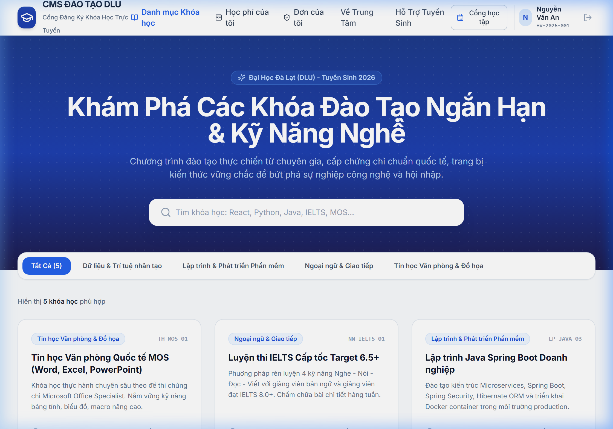
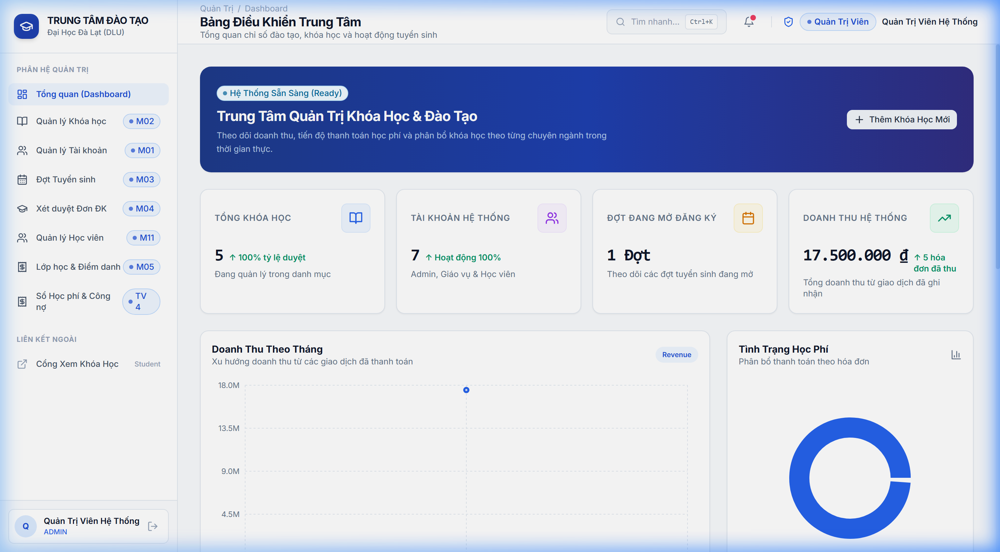
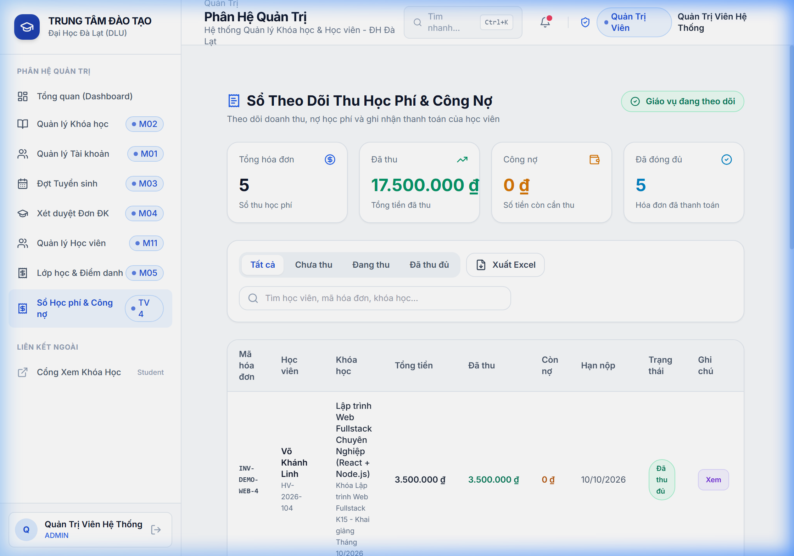

# 🎓 HỆ THỐNG QUẢN LÝ ĐĂNG KÝ KHÓA HỌC & HỌC VIÊN (CMS)
### TRUNG TÂM ĐÀO TẠO NGẮN HẠN & BỒI DƯỠNG KỸ NĂNG — ĐẠI HỌC ĐÀ LẠT (DLU)


---

## 🌟 Giao Diện Trang Chủ Tuyển Sinh (Landing Page)



---

## 📌 Giới Thiệu Dự Án

Hệ thống **CMS Đào Tạo DLU** là giải pháp số hóa toàn diện quy trình đào tạo ngắn hạn tại Trường Đại Học Đà Lạt:
- **Học viên & Khách**: Tra cứu khóa học, đăng ký tuyển sinh trực tuyến, nộp học phí qua mã QR tự động, theo dõi thời khóa biểu, nhật ký điểm danh chuyên cần và bảng điểm cá nhân.
- **Giáo vụ & Quản trị viên**: Quản lý danh mục khóa học, mở đợt tuyển sinh, xét duyệt đơn, phân bổ lớp học & xếp lịch, điểm danh từng buổi học, theo dõi công nợ và biểu đồ doanh thu theo thời gian thực.

---

## 👥 Bảng Phân Công Nhiệm Vụ 4 Thành Viên

| Thành viên | Phân hệ (Module) | Trách nhiệm chính |
| :--- | :--- | :--- |
| **Thành viên 1**<br>*(Team Lead)* | **M01, M02** | • Kiến trúc Monorepo (`pnpm`) & CSDL Prisma ORM 16 bảng<br>• Phân quyền RBAC, Đăng nhập / Đăng ký bảo mật JWT<br>• Quản trị Khóa học, Danh mục đào tạo (`/admin/courses`) |
| **Thành viên 2** | **M03, M04, M11** | • Quản lý Đợt tuyển sinh (`/admin/enrollment-periods`)<br>• Xét duyệt đơn đăng ký & tiếp nhận hồ sơ (`/admin/registrations`)<br>• Quản lý danh sách & hồ sơ học viên (`/admin/students`) |
| **Thành viên 3** | **M05, M07, M08** | • Quản lý Lớp học & sinh lịch buổi học tự động (`/admin/classes`)<br>• **Phân hệ Điểm danh buổi học** (Có mặt, Vắng, Trễ, Miễn)<br>• Cấu hình đầu điểm, nhập điểm và bảng điểm lớp học (`Gradebook`)<br>• Cổng học tập học viên (`/my-learning`): Thời khóa biểu, điểm danh & bảng điểm |
| **Thành viên 4** | **M06** | • Quản lý Học phí & Sổ theo dõi công nợ (`/admin/tuition`)<br>• Cổng thanh toán học viên (`/my-tuition`) kèm sinh mã QR chuyển khoản<br>• Ghi nhận giao dịch và xuất hóa đơn điện tử |

---

## 🖼️ Ảnh Chụp Các Phân Hệ Quản Trị

| Bảng Điều Khiển & Biểu Đồ Doanh Thu | Sổ Quản Lý Thu Học Phí & Công Nợ |
| :---: | :---: |
|  |  |

---

## 🚀 Hướng Dẫn Cài Đặt & Chạy Nhanh

### 1. Yêu cầu hệ thống
- **Node.js**: `>= 20.x`
- **pnpm**: `>= 9.x`

### 2. Cài đặt & Khởi tạo dữ liệu
```bash
# 1. Cài đặt thư viện toàn dự án
pnpm install

# 2. Khởi tạo CSDL & nạp dữ liệu demo
pnpm --filter @cms/backend prisma db seed

# 3. Chạy đồng thời Frontend & Backend
pnpm dev
```

Ứng dụng khởi chạy tại:
- **Frontend Web App**: `http://localhost:3000`
- **Backend REST API**: `http://localhost:5000/api/v1`

---

## 🔑 Tài Khoản Trải Nghiệm Demo

Trên màn hình `/login`, bạn có thể bấm trực tiếp vào các nút **Đăng nhập nhanh Demo** tương ứng:

| Quyền hạn | Email đăng nhập | Mật khẩu mặc định | Quyền truy cập |
| :--- | :--- | :--- | :--- |
| **Admin** | `admin@cms.dlu.edu.vn` | `Password123@` | Toàn quyền quản trị hệ thống, tài khoản, khóa học, doanh thu |
| **Staff (Giáo vụ)** | `staff@cms.dlu.edu.vn` | `Password123@` | Duyệt đơn, quản lý lớp, điểm danh, nhập điểm, thu học phí |
| **Student (Học viên)** | `student@cms.dlu.edu.vn` | `Password123@` | Đăng ký khóa học, xem học phí & QR, Cổng học tập `/my-learning` |

---

## 🛠️ Kiến Trúc Công Nghệ

- **Kiến trúc mã nguồn**: Monorepo TypeScript phân tầng chuẩn Layered Architecture (`Controller -> Service -> Repository/Prisma`).
- **Backend Stack**: Express.js, TypeScript, Prisma ORM, JWT, Bcrypt, CORS, Helmet, Winston Logger.
- **Frontend Stack**: React 18, Vite, TypeScript, Tailwind CSS, Lucide Icons, Recharts.
- **Cơ sở dữ liệu**: SQLite (Development) / PostgreSQL 16 (Production Docker Compose).
